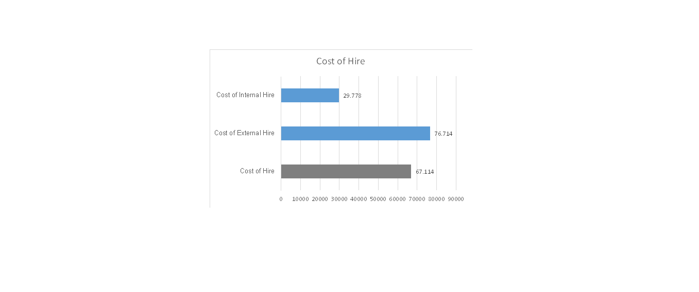
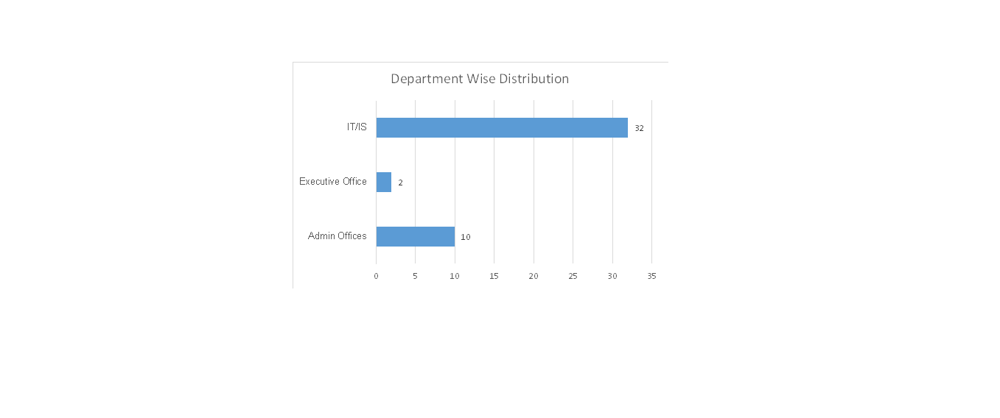
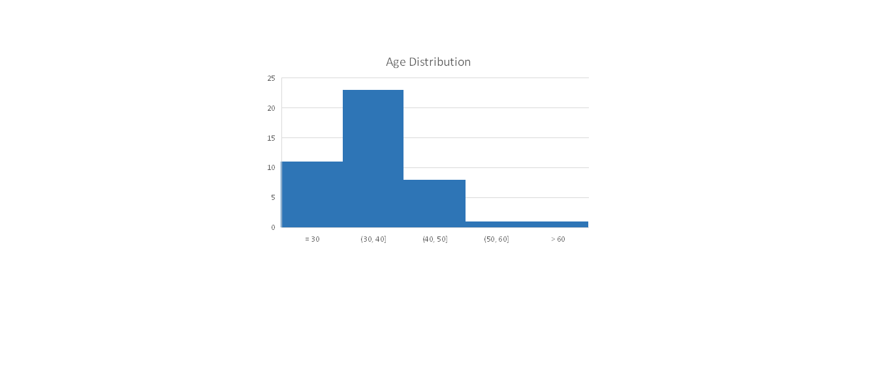

# hr-analytics-dashboard
# 📊 HR Analytics Case Study: Cost of Hire & Workforce Demographics

Welcome! This project presents a comprehensive HR analytics case study that analyzes hiring costs, departmental structure, and workforce demographics using Excel. It is designed to showcase data storytelling, business acumen, and technical skills tailored for HR Analyst and Data Analyst roles.

---

## 🎯 Project Objective

The goal of this case study is to analyze and visualize key Human Resources metrics to:
- Understand and optimize **Cost of Hire** (Total, Internal, External)
- Examine **Department-wise** distribution of employees
- Assess **Age** and **Gender** diversity across the organization
- Provide actionable insights to inform HR strategy and decision-making

---

## 🧰 Tools & Techniques Used

- **Microsoft Excel**
  - Advanced formulas: `AVERAGEIF`, `IF`, `VLOOKUP`, `SUMIFS`
  - Data cleaning and transformation
  - PivotTables and PivotCharts
  - Chart design and formatting

- **Data Visualization**
  - Histogram Charts
  - Tree Charts
  - Pie Charts
  - Bar Charts
  - Clean, professional chart styling

---

## 📊 Key Metrics & Insights

### 💵 1. Cost of Hire Analysis
| Type             | Average Cost (in currency units) |
|------------------|----------------------------------|
| Total Hire Cost  | 67,114                           |
| Internal Hires   | 29,778                           |
| External Hires   | 76,714                           |

**🔍 Insight:**  
External hiring costs are over **2.5 times higher** than internal promotions. This highlights the value of strengthening internal talent pipelines and investing in employee development to reduce recruitment expenses.

🖼️ 

---

### 🧑‍💻 2. Department-Wise Distribution

| Department        | No. of Employees |
|-------------------|------------------|
| IT/IS             | 32               |
| Admin Offices     | 10               |
| Executive Office  | 2                |
| Others            | 22               |

**🔍 Insight:**  
The **IT/IS department** dominates headcount, suggesting the organization’s core focus is technology-driven. A smaller executive team may reflect a lean leadership structure.

🖼️ 

---

### 🎂 3. Age Distribution

- **Most employees (30–40 years)** are in their prime working years.
- **Fewer employees over 50**, indicating a younger workforce overall.

**🔍 Insight:**  
This demographic suggests strong mid-level talent but may also point to succession planning needs as the workforce matures.

🖼️ 

---

### ⚖️ 4. Gender Diversity

| Gender | No. of Employees |
|--------|------------------|
| Male   | 22               |
| Female | 22               |

**🔍 Insight:**  
An equal gender split indicates excellent diversity. Maintaining this balance supports inclusion, improved collaboration, and innovation.

🖼️ 

---

## 📁 Files Included

- `HR_Analytics_Case_Study.xlsx` – Cleaned data, calculations, PivotTables
- `Cost_of_Hire_Chart.png`
- `Department_Wise_Distribution_Chart.png`
- `Age_Distribution_Chart.png`
- `Gender_Distribution_Chart.png`
- `README.md`

---

## 📚 Skills Demonstrated

✅ Data Cleaning & Validation  
✅ Advanced Excel Formula Application  
✅ PivotTables for Dynamic Analysis  
✅ Chart Creation & Formatting  
✅ Insight Generation & Business Recommendations  
✅ Clear Data Storytelling for Non-Technical Stakeholders  

---

## 🚀 Impact & Recommendations

- **Reduce hiring costs** through internal promotion programs
- **Support leadership development** for succession planning
- **Preserve gender balance** through inclusive recruitment strategies
- **Prioritize digital skills** given the dominance of the IT department

---

## 🙋‍♂️ About Me

Hi, I’m Max Nguyen – a Data Analyst with a passion for HR analytics, business intelligence, and data storytelling. I built this case study to demonstrate how Excel can turn raw HR data into insights that support strategic workforce planning.

- 📧 Email: maxnguyenhoangminh@gmail.com  
- 💼 [LinkedIn](https://www.linkedin.com/in/max-nguyen-hoang-minh)  

---

## 💬 Let's Connect

If you're hiring for an HR Analyst, Business Intelligence, or Data Analyst role — let’s talk! I’m always open to new opportunities where I can use data to drive better people decisions.

---

> *“What gets measured gets managed.” – Peter Drucker*  
This case study is a step toward better measurement and smarter HR decisions.
